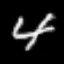
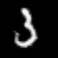

# MNIST GAN

This is a repository for training a [conditional GAN](https://arxiv.org/abs/1411.1784) for the [MNIST dataset](yann.lecun.com/exdb/mnist/).
The GAN is optimized using the [Wasserstein loss](https://arxiv.org/abs/1701.07875) and the [Wasserstein gradient penalty](https://arxiv.org/abs/1704.00028).
A [DCGAN-like](https://arxiv.org/abs/1511.06434) architecture is used along with [spectral normalization](https://arxiv.org/abs/1802.05957) for the critic.

## Instructions

All Python scripts use argparse to parse commandline arguments.
For viewing the list of all positional and optional arguments for any script, type:
```sh
./script.py --help
```

### Setup
[Poetry](https://python-poetry.org/) is used for conveniently installing and managing dependencies.

1. *[Optional]* Create and activate a virtual environment with Python >= 3.8.

2. Install Poetry globally (recommended), or in a virtual environment.
    Please refer to [Poetry's installation guide](https://python-poetry.org/docs/#installation) for recommended installation options.

    You can use pip to install it:
    ```sh
    pip install poetry
    ```

3. Install all dependencies with Poetry:
    ```sh
    poetry install --no-dev
    ```

    If you didn't create and activate a virtual environment in step 1, Poetry creates one for you and installs all dependencies there.
    To use this virtual environment, run:
    ```sh
    poetry shell
    ```

4. Download the MNIST dataset using the provided script (requires cURL >= 7.19.0):
    ```sh
    ./download_mnist.sh [/path/where/dataset/should/be/saved/]
    ```

    By default, this dataset is saved to the directory `datasets/MNIST`.

#### For Contributing
[pre-commit](https://pre-commit.com/) is used for managing hooks that run before each commit, to ensure code quality and run some basic tests.
Thus, this needs to be set up only when one intends to commit changes to git.

1. Activate the virtual environment where you installed the dependencies.

2. Install all dependencies, including extra dependencies for development:
    ```sh
    poetry install
    ```

3. Install pre-commit hooks:
    ```sh
    pre-commit install
    ```

**NOTE**: You need to be inside the virtual environment where you installed the above dependencies every time you commit.
However, this is not required if you have installed pre-commit globally.

### Hyper-Parameter Configuration
Hyper-parameters can be specified through YAML configs.
For example, to specify a batch size of 32 for the GAN and a learning rate of 0.001 for the generator, use the following config:
```yaml
gan_batch_size: 32
gen_lr: 0.001
```

You can store configs in a directory named `configs` located in the root of this repository.
It has an entry in the [`.gitignore`](./.gitignore) file so that custom configs aren't picked up by git.

The available hyper-parameters, their documentation and default values are specified in the `Config` class in the file [`gan/utils.py`](./gan/utils.py).

### Training
The GAN uses [Frechet Inception Distance](https://arxiv.org/abs/1706.08500) for evaluating its performance during training time.
For this, we need to train a classifier before training the GAN.

* Classifier: Run `classifier.py`:
    ```sh
    ./classifier.py
    ```

* GAN: Run `train.py` after training a classifier:
    ```sh
    ./train.py
    ```

The weights of trained models are saved in TensorFlow's ckpt format to the directory given by the `--save-dir` argument.
By default, this directory is `checkpoints` for both the classifier and the GAN.

Training logs are by default stored inside an ISO 8601 timestamp named subdirectory, which is stored in a parent directory (as given by the `--log-dir` argument).
By default, this directory is `logs/classifier` for classifier, and `logs/gan` for the GAN.

The hyper-parameter config is saved as a YAML file in both the model checkpoint directory and the timestamped log directory.
For the classifier, it is named `config-cls.yaml`, and for the GAN, it is named `config-gan.yaml`.

#### Multi-GPU Training
This implementation supports multi-GPU training on a single machine for both the classifier and the GAN using TensorFlow's [`tf.distribute.MirroredStrategy`](https://www.tensorflow.org/tutorials/distribute/custom_training#create_a_strategy_to_distribute_the_variables_and_the_graph).

For choosing which GPUs to train on, set the `CUDA_VISIBLE_DEVICES` environment variable when running a script as follows:
```sh
CUDA_VISIBLE_DEVICES=0,1,3 ./script.py
```
This selects the GPUs 0, 1 and 3 for training.
By default, all available GPUs are chosen.

#### On-demand GPU Memory
TensorFlow allocates all the available GPU memory on each GPU.
To instruct TensorFlow to allocate GPU memory only on demand, set the `TF_FORCE_GPU_ALLOW_GROWTH` environment variable when running a script as follows:
```sh
TF_FORCE_GPU_ALLOW_GROWTH=true ./script.py
```

#### Mixed Precision Training
This implementation supports mixed-precision training.
This can be enabled by setting the `mixed_precision` hyper-parameter in a config, as follows:
```yaml
mixed_precision: true
```

Note that this will only provide significant speed-ups if your GPU(s) have special support for mixed-precision compute.

### Generation
A generation script is provided to generate images using a trained GAN.
This will generate an equal number of images for each class in the dataset.

Run `generate.py`:
```sh
./generate.py
```
The generated images are saved in the directory given by the `--output-dir` argument.
By default, this directory is `outputs`.
The images will be saved as JPEG images with the file name formatted as `{class_num}-{instance_num}.jpg`.
Here, `{class_num}` is the index of the image's class, and `{instance_num}` signifies whether this is the 1st, 2nd, or nth image generated from that class.

## Samples
<p align="center">
             
    <br>
             
    <br>
             
</p>
